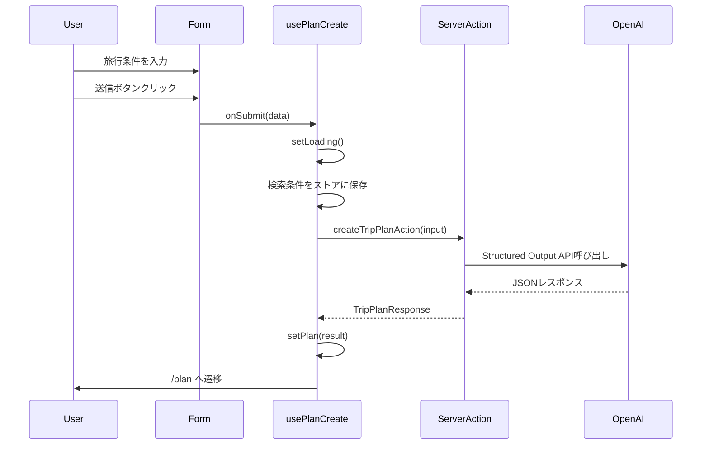

# たびくみ システム仕様書

## 概要

「たびくみ」は、ユーザーが行きたい場所を入力するだけで、AIが移動時間を考慮した現実的な旅行プランを自動作成するWebアプリケーションです。

### コンセプト
> 「無理のない旅程で、行きたいを最大限に。」

---

## システム構成

### 技術スタック
| カテゴリ | 技術 |
|---------|------|
| フレームワーク | Next.js 16 (App Router) |
| 言語 | TypeScript |
| スタイリング | Tailwind CSS v4 |
| 状態管理 | Zustand |
| フォーム | React Hook Form + Zod |
| AI | OpenAI API (GPT-4o) |
| デプロイ | Vercel |

---

## 機能仕様

## 1. プラン作成機能 (planCreate)

### 1.1 概要
ユーザーが旅行条件を入力し、AIに旅行プランの生成をリクエストする機能。

### 1.2 入力項目

#### 必須項目

| 項目 | 型 | バリデーション | 説明 |
|------|-----|---------------|------|
| startDate | string | YYYY-MM-DD形式 | 旅行開始日 |
| endDate | string | YYYY-MM-DD形式、startDate以降 | 旅行終了日 |
| departure | string | 1文字以上 | 出発地点（空港、駅など） |
| departureTime | string | HH:MM形式 | 出発時刻（デフォルト: 09:00） |
| baseStay | string | 1文字以上 | 宿泊拠点（毎晩戻る場所） |
| spots | array | 1件以上 | 行きたいスポットのリスト |
| transportMode | enum | "car" \| "transit" \| "walk" | 移動手段（デフォルト: transit） |
| pace | enum | "relaxed" \| "normal" \| "packed" | 旅のペース（デフォルト: normal） |

#### 任意項目（終了条件）

| 項目 | 型 | バリデーション | 説明 |
|------|-----|---------------|------|
| endLocation | string | - | 最終到着地点（未指定時は出発地点に帰着） |
| endTime | string | HH:MM形式 | 最終日の到着希望時刻（デフォルト: 19:00） |

### 1.3 交通手段 (transportMode)

| 値 | 表示名 | 説明 |
|-----|--------|------|
| car | 車 | 車での移動を前提。駐車場確保を考慮 |
| transit | 公共交通 | 電車・バスでの移動。乗換時間を考慮 |
| walk | 徒歩中心 | 徒歩移動が基本。距離制約を厳しめに |

### 1.4 旅のペース (pace)

| 値 | 表示名 | 説明 |
|-----|--------|------|
| relaxed | ゆったり | スポット数控えめ、余白多め（2〜3箇所/日） |
| normal | ふつう | 標準的なスポット数（3〜5箇所/日） |
| packed | ぎゅっと | スポット数多め、効率重視（4〜6箇所/日） |

### 1.5 コンポーネント構成

```
planCreate/
├── PlanCreateContainer.tsx  # ロジック層（Hooks統合）
├── PlanCreatePresentation.tsx  # 表示層（UI）
├── planCreate.type.ts  # 型定義・Zodスキーマ
├── ai/
│   ├── createTripPlan.ts  # AI呼び出し本体
│   ├── createTripPlanAction.ts  # Server Action
│   ├── systemPrompt.ts  # AIへのプロンプト
│   └── tripPlan.schema.ts  # レスポンスJSONスキーマ
└── hooks/
    ├── usePlanForm.ts  # フォーム管理
    ├── usePlanCreate.ts  # 送信・AI呼び出し
    └── usePlanSpots.ts  # スポット配列管理
```

### 1.6 フロー



---

## 2. AI旅行プラン生成

### 2.1 概要
OpenAI APIを使用して、ユーザーの入力条件から最適な旅行プランを生成する。

### 2.2 使用API
- **OpenAI Responses API** (Structured Outputs)
- **モデル**: GPT-4o（環境変数 `OPENAI_MODEL` で変更可能）

### 2.3 システムプロンプト要約

AIは以下のルールに従ってプランを生成：

1. **実現可能性の判定** (`feasibility`)
   - 全スポットを無理なく回れるか判定
   - 判定理由を日本語で要約

2. **日別プラン生成** (`plan`)
   - 各日に theme（テーマ）を設定
   - 以下のアイテムタイプを含む：
     - `spot`: 観光スポット
     - `meal`: 食事（昼食・夕食）
     - `hotel`: 宿泊拠点への帰着/出発
     - `travel`: 移動時間

3. **日ごとの開始地点ルール**
   - 1日目: `startLocation`（出発地点）から開始
   - 2日目以降: `baseStay`（宿泊拠点）から開始
   - 各日の終わり: `baseStay` への帰着を含める
   - 最終日: 
     - `endLocation` 指定時: `endLocation` への到着
     - 未指定時: `startLocation` への帰着（帰路）を考慮
     - `endTime` 指定時: その時刻までに到着（最優先制約）

4. **交通手段による調整**
   - `car`: 車前提の移動時間、駐車場確保を考慮
   - `transit`: 乗換・待ち時間を加算（+10〜20分）
   - `walk`: 1日の移動距離を控えめに（合計10km以内目安）

5. **ペースによる調整**
   - `relaxed`: 滞在時間+20〜30%、カフェ休憩を挿入
   - `normal`: 標準的な所要時間
   - `packed`: 滞在時間短縮、ただし破綻は避ける

6. **制約条件**
   - タイムゾーン: Asia/Tokyo
   - 1日の活動時間: 出発時刻〜21:00程度
   - 食事時間: 昼 11:30-13:30、夜 18:00-20:00 目安

### 2.4 リクエスト構造 (`TripPlanRequest`)

```typescript
type TripPlanRequest = {
  startDate: string;      // "YYYY-MM-DD"
  endDate: string;        // "YYYY-MM-DD"
  startLocation: string;
  startTime: string;      // "HH:mm"
  baseStay: string;
  spots: string[];
  endLocation?: string;   // 最終到着地点（任意）
  endTime?: string;       // 到着希望時刻（任意）
  transportMode: "car" | "transit" | "walk";
  pace: "relaxed" | "normal" | "packed";
};
```

### 2.5 レスポンス構造 (`TripPlanResponse`)

```typescript
type TripPlanResponse = {
  version: "trip-plan.v2";
  timezone: "Asia/Tokyo";
  request: TripPlanRequest;  // 入力条件のエコーバック
  feasibility: {
    isFeasible: boolean;     // 実現可能かどうか
    summary: string;         // 判定理由
  };
  plan: {
    title: string;           // プランタイトル
    totalDays: number;       // 総日数
    days: TripPlanDay[];     // 日別プラン
  };
  issues: TripPlanIssue[];   // 問題点・注意点
  alternatives: TripPlanAlternative[];  // 代替案
};
```

### 2.6 問題点タイプ (`TripPlanIssue`)

| type | 説明 |
|------|------|
| time | 時間不足 |
| distance | 移動距離過多 |
| constraint | 営業時間等の制約 |
| capacity | 詰め込みすぎ |

| severity | 説明 |
|----------|------|
| critical | 旅程が成立しない |
| warning | 推奨しない |
| info | 参考情報 |

---

## 3. プラン詳細表示機能 (planDetail)

### 3.1 概要
AIが生成した旅行プランを表示・共有する機能。

### 3.2 コンポーネント構成

```
planDetail/
├── PlanDetailContainer.tsx  # ロジック層
├── PlanDetailPresentation.tsx  # 表示層
├── planDetail.type.ts  # 型定義
└── hooks/
    └── usePlanDetail.ts  # データ取得・整形
```

### 3.3 表示要素

1. **サマリーカード**
   - プランタイトル
   - 実現可能性（成功: 青、問題あり: オレンジ）
   - 日程、出発地点、宿泊拠点、スポット数
   - 終了条件（指定時のみ）: 到着時刻 / 到着地点
   - 移動手段とペース

2. **注意点・問題点セクション** （issues がある場合）
   - 問題の種類、重要度、説明、影響するスポット

3. **代替案・提案セクション** （alternatives がある場合）
   - 代替案タイトル、説明、変更内容リスト

4. **日別プラン**
   - 日付とテーマ
   - タイムライン形式でアイテム表示
   - アイコンでタイプを区別（観光、食事、移動、宿泊）

5. **アクションボタン**
   - 「条件を変更」: 入力画面に戻る（条件保持）
   - 「共有リンクをコピー」: URLをクリップボードにコピー
   - 「新しいプランを作成」: 条件をリセットして新規作成

### 3.4 共有機能

プランデータをBase64エンコードしてURLパラメータに含めることで、URLだけでプランを共有可能。

```
https://example.com/plan?data=<Base64エンコードされたプランデータ>
```

- **エンコード**: `encodePlanToUrl(plan)` - JSON → Base64
- **デコード**: `decodePlanFromUrl(encoded)` - Base64 → JSON + バリデーション
- **共有URL生成**: `generateShareUrl(plan)`
- **クリップボードコピー**: `copyShareUrlToClipboard(plan)`

**後方互換性:**
- デコード時に新しいフィールド（transportMode, pace, endLocation, endTime）がない場合はデフォルト値を使用
- version は "trip-plan.v2" のまま維持

---

## 4. 状態管理

### 4.1 useTripPlanStore（旅行プラン状態）

```typescript
interface TripPlanState {
  plan: TripPlanResponse | null;  // プラン結果
  status: 'idle' | 'loading' | 'success' | 'error';
  error: string | null;
}
```

**アクション:**
- `setLoading()`: ローディング開始
- `setPlan(plan)`: プラン設定
- `setError(error)`: エラー設定
- `reset()`: リセット

### 4.2 useSearchConditionStore（検索条件状態）

```typescript
interface SearchCondition {
  startDate: string;
  endDate: string;
  departure: string;
  departureTime: string;
  baseStay: string;
  spots: string[];
  endLocation?: string;      // 任意
  endTime?: string;          // 任意
  transportMode: TransportMode;  // "car" | "transit" | "walk"
  pace: Pace;                    // "relaxed" | "normal" | "packed"
}
```

**アクション:**
- `setCondition(condition)`: 条件設定
- `clearCondition()`: クリア

**用途:**
- フォームの初期値復元（「条件を変更」時）
- プラン詳細画面での条件表示

---

## 5. 画面遷移

```
/ (トップページ)
├── フォーム入力
├── 送信 → ローディング表示
└── 成功 → /plan へ遷移

/plan (プラン詳細)
├── プラン表示
├── 「条件を変更」→ / へ（条件保持）
├── 「新しいプランを作成」→ / へ（条件リセット）
└── 「共有リンクをコピー」→ クリップボードにURL

/plan?data=xxx (共有リンク)
└── URLからプランをデコードして表示
```

---

## 6. 環境変数

| 変数名 | 必須 | 説明 |
|--------|------|------|
| OPENAI_API_KEY | ✓ | OpenAI APIキー |
| OPENAI_MODEL | - | 使用モデル（デフォルト: gpt-4o） |
| NEXT_PUBLIC_BASE_URL | - | サイトのベースURL（サイトマップ用） |

---

## 7. ディレクトリ構成

```
src/
├── app/                    # Next.js App Router
│   ├── page.tsx           # トップページ（プラン作成）
│   ├── plan/page.tsx      # プラン詳細
│   ├── sitemap.ts         # サイトマップ生成
│   └── robots.ts          # robots.txt生成
├── features/
│   ├── planCreate/        # プラン作成機能
│   └── planDetail/        # プラン詳細機能
├── shared/
│   ├── ai/                # AI関連共通
│   │   └── openaiClient.ts
│   └── store/             # Zustand ストア
│       ├── useTripPlanStore.ts
│       └── useSearchConditionStore.ts
├── components/            # 共通UIコンポーネント
└── lib/                   # ユーティリティ
    ├── utils.ts
    └── planShare.ts       # 共有機能
```

---

## 更新履歴

| 日付 | バージョン | 内容 |
|------|-----------|------|
| 2026-01-19 | 1.0.0 | 初版作成 |
| 2026-01-20 | 1.1.0 | 入力項目追加（endLocation, endTime, transportMode, pace） |
